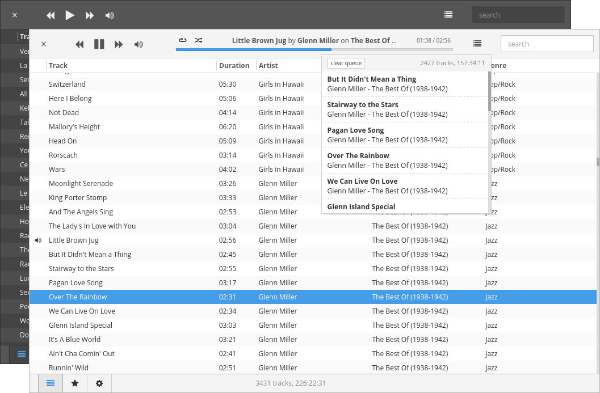

# museeks

A simple, clean and cross-platform music player. ([museeks.io](http://museeks.io))

It uses:
* [Node.js](https://nodejs.org/en/) for back-end
* [electron (used to be atom-shell)](https://github.com/atom/electron/) for embedded browser
* [React.js](https://facebook.github.io/react/) as front-end framework and [Flux](https://facebook.github.io/flux/) with  [Redux](http://redux.js.org/) as data-flow pattern

===

### Features

- Lightweight music player
- Polished
- Playlists
- Queue management
- Shuffle, loop
- Covers
- Dark theme
- Playback speed control
- Sleep mode blocker
- Supported formats:
    - mp3
    - mp4
    - m4a/aac
    - wav
    - ogg
    - 3gpp

===

### Releases notes

- [Releases notes](https://github.com/KeitIG/museeks/releases)

===

### Installation

#### Classic

Builds can be found [at this page](https://github.com/KeitIG/museeks/releases). Please notice those are only portable versions. Installers are on the road.

#### Build (advanced)

Please consider that **`master` is unstable.**

- Download [Electron](https://github.com/atom/electron/releases)
- Download Museeks source code
- Put it in a folder called `app` in `[Electron path]/resources`
- `npm install && npm run compile`
- Run Electron

===

### Troubleshooting

Museeks is currently in development. This implies some things can break after an update (database schemes changes, config...).

If you encounter freezes when starting the app, you can reset Museeks by following these steps:

- Go to the Museeks folder directory
    - Windows: `%AppData%\museeks`
    - OSX: `~/Library/Application Support/museeks`
    - Linux: `~/.config/museeks/` or `$XDG_CONFIG_HOME/museeks`
- Delete:
    - `IndexedDB` folder
    - `config.json` file
- Restart Museeks

If you still get problems after that, please open an issue :)

===

### Bug report

If you want to report a bug, first, thanks a lot. To help us, please indicate your OS, your Museeks version, and how to reproduce it. Adding a screen of the console (Settings -> Advanced -> enable dev mode) is a big help too.

===

### Architecture

Read about the code architecture in `docs/code/architecture`.

===

### Contribute

- Fork and clone
- Master is usually unstable, checkout to a tag to have a stable state of the app

- Install the latest version of electron either by running `npm install -g electron` or downloading the latest release available [here](https://github.com/electron/electron/releases) and just drop the app on `resources/` folder.
- You can use electron now with `electron [electronapp-dir]` command if you installed electron using npm or by running your downloaded electron.

- `npm install && npm run dev` then run in a separate terminal `electron .`
- `npm run dev` will watch for file changes using Webpack which will recompile JSX and SASS files.

- Enable dev mode in the app in the settings view to show DevTools

Please respect a few rules:

- Before making complex stuff, don't hesitate to open an issue first to discuss about it
- Make the code readable and comment if needed
- Make sure `npm run lint` passes

Then open a PR :)
